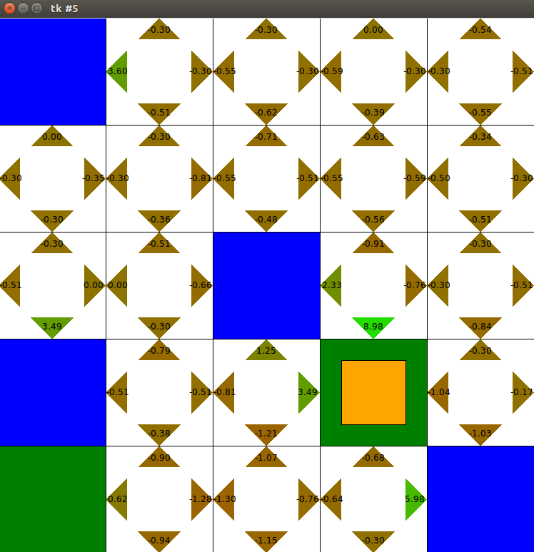

# Reinforcement Learning
This is the code to implement Reinforcement Learning and learn how it works.

##Overview

This is game 

	● Rules: Each blue box has 4 stones, Each green box can hold 8 stones each, the agent needs to find an optimal way to drop the stones in the green boxes, with max reward as possible.
	● The agent (yellow box) can only carry one stone at a time.
	● The agent cannot drop at any other location except in the green box.
	● Rewards: Each step gives a negative reward of -1. Pickup gives a reward of +12, and Dropoff gives a reward of +12.
	● States: Each cell is a state the agent can be.
	● Actions: There are only 6 actions. Up, Down, Right, Left, Pickup, DropOff.

## Dependencies

-Python 2.7
-tkinter

If on Ubuntu you can install tkinter for python2.7 with
$sudo apt-get install python-tk

## Usage

Run `python Learner.py` in terminal to see the the bot in action. It'll find the optimal strategy.
